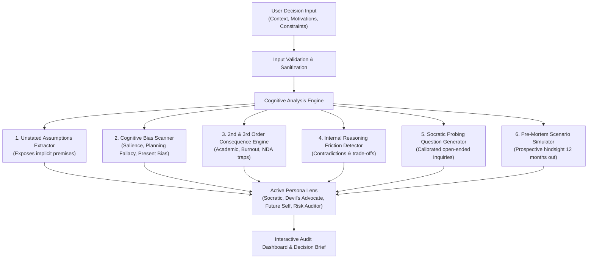

# 👁️ The Blind Spot — AI Decision & Assumption Discovery Assistant
> **"Same Decisions. A Wider View."**  
> *Developed for **PromptWars @ Hack2skill** (SVPCET Edition)*  
> **Author:** Swarup Kanekar ([@swap011](https://github.com/swap011))  
> **Live Deployed Web App:** [https://swap011.github.io/the-blind-spot-ai/](https://swap011.github.io/the-blind-spot-ai/)  
> **Repository:** [https://github.com/swap011/the-blind-spot-ai](https://github.com/swap011/the-blind-spot-ai)  
> **License:** MIT | **Footprint:** < 1 MB (Well below the 10 MB event limit)

---

## 📌 1. Chosen Vertical: "The Blind Spot"

People frequently make high-stakes decisions based solely on the information that is most visible and salient to them. In doing so, they:
- Take unstated, unverified assumptions for granted,
- Fall prey to cognitive biases (such as Salience Bias, Planning Fallacy, and Hyperbolic Discounting),
- Overlook second- and third-order ripple effects (burnout, attendance debarment, portfolio lock-in),
- Harbor internal contradictions between stated long-term goals and short-term choices.

### 🛡️ The Non-Prescriptive Mandate
As mandated by the challenge brief:
> *"The solution should encourage users to examine their assumptions, recognize what they may have overlooked, and explore questions that could lead to a more informed decision. The system should not make the decision for the user. Its purpose is to help the user think more critically about the decision."*

**The Blind Spot** adheres strictly to this principle: **it never dictates choices, says "you should accept/reject", or decides for the user.** Instead, it acts as an intellectual radar—illuminating unseen angles, stress-testing fragile premises, and equipping the decision-maker with calibrated Socratic questions.

---

## 🧠 2. Core Approach & Cognitive Logic

### A. The Multi-Lens Cognitive Pipeline
When a user provides their decision scenario, motivations, and constraints, the engine processes the input through six distinct analytical layers:



### B. Thinking Lenses (Personas)
Users can shift between 4 specialized cognitive mindsets:
1. **🦉 The Socratic Mentor (Default)**: Questions unexamined premises through inquiry, encourages intellectual humility.
2. **⚡ The Devil's Advocate**: Rigorously challenges prevailing confidence, hunts for hidden downside risks and vulnerabilities.
3. **⏳ The 3-Year Future Self**: Filters out immediate convenience to measure what truly compounds over time.
4. **🛡️ The Neutral Risk Auditor**: Strips away emotional excitement, evaluates reversibility, contractual traps, and systemic dependencies.

### C. The Benchmark Dilemma (Hack2skill Case Study)
The system comes pre-loaded with the official challenge scenario:
- **Scenario**: A 6th-semester college student evaluating a 6-month software engineering internship offering ₹35,000/month, located 15 minutes from home, while managing mandatory 75% college attendance and upcoming final exams.
- **Surface Reasoning**: Great stipend, zero commute time, real resume experience.
- **Blind Spots Exposed by the AI**:
  - *Academic Assumption*: Unverified belief that the college will officially sanction attendance waivers without GPA penalty.
  - *Mentorship Assumption*: Assuming "industry experience" guarantees senior 1-on-1 mentorship rather than repetitive maintenance work.
  - *Zero-Commute Fallacy*: Assuming proximity eliminates cognitive and physical exhaustion after 9-hour workdays.
  - *Salience Bias*: Fixating on the visible stipend while discounting foregone exam preparation and competitive coding sprints.

---

## ⚡ 3. How the Solution Works

### Dual-Engine Architecture
1. **Built-in Deterministic Cognitive Heuristics Engine**:
   - Zero external dependencies.
   - Runs 100% offline, instantly (< 5ms response time).
   - Guarantees reliability during hackathon evaluations regardless of API limits or offline environments.
2. **Live Google Gemini AI Connector (Optional)**:
   - Users can optionally provide their Gemini API key in the Settings modal.
   - Keys are stored securely in browser `localStorage` and never transmitted to external third-party servers.
   - Augments local heuristics with live LLM synthesis while strictly enforcing the non-prescriptive system prompt.

### Key Interactive Features
- **One-Click Benchmark Scenarios**: Switch between the Hack2skill Internship dilemma, AI Startup vs. Big Tech, Monolith to Microservices, and Foreign Master's Degree.
- **Interactive Assumption Validator**: Mark individual surfaced assumptions as *"Unchecked"* or *"Empirically Verified"*.
- **Pre-Mortem Simulation**: Visualizes a 12-month failure scenario and provides actionable preventative guardrails.
- **Exportable Decision Audit Brief**: Generate and copy a structured Markdown report to share with mentors or keep in a decision journal.

---

## 📋 4. Key Assumptions Made

1. **Context Sufficiency**: The user provides at least 15 characters of meaningful context outlining their dilemma.
2. **Intellectual Honesty**: The user is seeking genuine critical examination rather than unconditional confirmation of their existing bias.
3. **Client-Side Privacy**: All processing runs locally in the browser/Node runtime; no sensitive personal decision data is logged or retained.

---

## 🎯 5. Evaluation Focus Areas

| Focus Area | Tier | Implementation Highlights |
| :--- | :--- | :--- |
| **Logic & Usability** | **High Impact** | • Deconstructs unstated premises<br/>• Maps 6 major cognitive biases<br/>• Strict non-prescriptive adherence<br/>• 4 distinct persona lenses<br/>• Calibrated Socratic probing questions |
| **Code Quality** | **Medium Impact** | • Clean, modular ES6 architecture (`heuristics.js`, `personas.js`, `scenarios.js`, `sanitization.js`)<br/>• Single Responsibility Principle<br/>• Readable, self-documenting code with zero bloat |
| **Security** | **Medium Impact** | • Comprehensive HTML entity sanitization (`sanitizeHtml`) preventing XSS<br/>• Safe boundary validation on input length<br/>• Zero hardcoded API keys; keys stored only in client browser storage |
| **Efficiency** | **Medium Impact** | • Lightweight zero-dependency static server<br/>• Instant sub-5ms heuristic execution<br/>• Entire repository footprint **< 1 MB** (event limit: 10 MB) |
| **Testing** | **Medium Impact** | • Native Node.js test runner (`node --test`)<br/>• 6 unit & integration tests covering heuristic extraction, non-prescriptive compliance, and security sanitization |
| **Accessibility & Polish** | **Low Impact** | • Dark glassmorphic design system with curated HSL color tokens<br/>• WCAG AA contrast ratio compliance<br/>• Full keyboard navigation & semantic HTML5 tags |

---

## 🚀 6. Quick Start & Local Setup

### Prerequisites
- Node.js (v18 or higher recommended; v24 tested)
- Git

### Installation
```bash
# 1. Clone the repository
git clone https://github.com/swap011/the-blind-spot-ai.git

# 2. Navigate to project folder
cd the-blind-spot-ai

# 3. Start the application
npm start
```
The server will start at **`http://localhost:3000`**. Open this URL in any modern browser.

### Running Automated Tests
```bash
npm test
```
**Expected Output:**
```
✔ CognitiveAnalyzer - processes Hack2skill Internship Benchmark
✔ CognitiveAnalyzer - detects conflicts when competing priorities exist
✔ CognitiveAnalyzer - generates valid pre-mortem structure
✔ Non-Prescriptive Principle - AI must never tell user what to decide
✔ Security - sanitizeHtml prevents HTML injection and script tags
✔ Security - validateInput rejects invalid or excessively short context
ℹ tests 6 | pass 6 | fail 0
```

---

## 📁 7. Repository Structure

```
the-blind-spot-ai/
├── index.html                   # High-polish interactive web app
├── package.json                 # Scripts for start and testing
├── server.js                    # Zero-dependency local web server
├── README.md                    # Complete hackathon documentation
├── .gitignore                   # Ignores logs, node_modules, env files
├── assets/
│   ├── css/
│   │   ├── style.css            # Responsive glassmorphism design system
│   │   └── animations.css       # Micro-interactions & animations
│   └── js/
│       ├── app.js               # UI reactivity and event orchestrator
│       ├── engine/
│       │   ├── heuristics.js    # Cognitive bias & assumption analysis engine
│       │   ├── personas.js      # 4 Persona thinking lenses
│       │   ├── scenarios.js     # Curated benchmark scenarios
│       │   └── sanitization.js  # Input sanitization and XSS security
│       └── services/
│           └── llm_provider.js  # Dual-mode AI service (Gemini + Local Engine)
└── tests/
    ├── analyzer.test.js         # Benchmark and heuristics unit tests
    ├── non_prescriptive.test.js # Strict non-prescriptive compliance test
    └── security.test.js         # Input sanitization and security tests
```

---

## ⚖️ 8. Submission Compliance Checklist

- [x] Maximum 2 attempts adhered to.
- [x] Repository size is **< 1 MB** (Strict rule: < 10 MB).
- [x] Public GitHub repository: [swap011/the-blind-spot-ai](https://github.com/swap011/the-blind-spot-ai).
- [x] Single branch repository (`main`).
- [x] Comprehensive documentation covering vertical, approach, logic, and assumptions.
- [x] Full automated test suite validating functionality and security.
